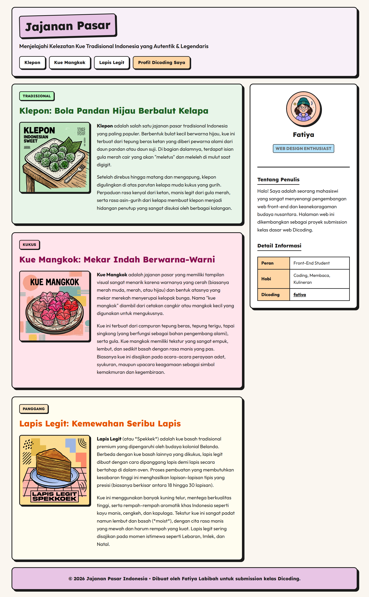

**Jajanan Pasar** adalah website yang menampilkan beberapa kue tradisional dan disesuaikan dengan menggunakan tema "Neobrutalist Pastel". 

Project website simple ini diperuntukkan submission tugas **Dasar Pemrograman Web - DBS Foundation (Dicoding)**.

## Komponen

* **Header** menampilkan judul, slogan, dan navlink yang akan digulirkan ke bagian tersebut.
* **Main** yang membagi halaman menjadi 2 section yaitu article dan aside.
* **Article** Menampilkan beberapa content dengan yang menunjukkan jajanan dari gambar, label, dan teks penjelasan.
* **Aside** Bagian sisi kanan yang menampilkan profil singkat dari sang pembuat yaitu saya.

### Warna yang digunakan
Warna yang dipilih untuk website ini pastel.
| Warna | Tampilan | Kode |
|---|---| --- |
| pink |  | #FFC2D1
| pink-light |  | #FFE5EC
| green |  | #E8F5E9
| green-light |  | #E8F5E9
| yellow |  | #FBE7C6
| yellow-light |  | #FFFDF0
| purple |  | #E8C5E5
| purple-light |  | #F8F0F8
| orange |  | #FFD6A5
| blue |  | #B5E2FA
---

## Kontributor & Kontribusi

**Jajanan Pasar** is designed and developed by:

📎**Fatiya Labibah** - *Fullstack Developer*

---
*© 2026 Jajanan Pasar. Developed for Dicoding.*